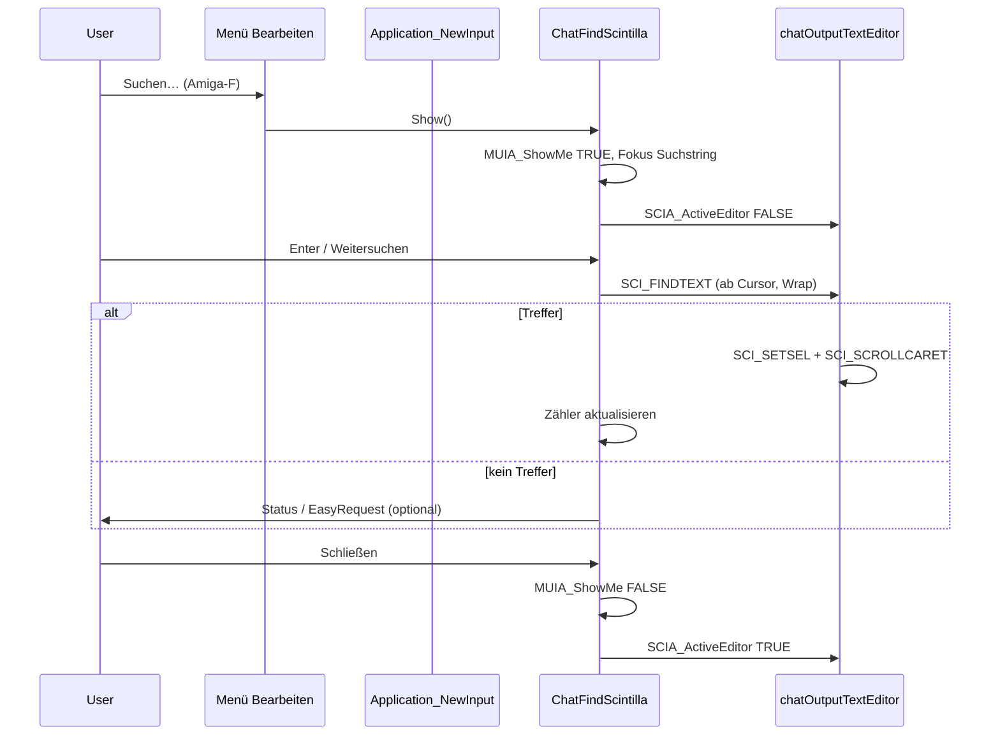

# Chat-Suche (MorphOS) — Ablauf-Skizze

**Status:** implementiert, Hardware-Abnahme 2026-06 (`feat/chat-find-scintilla`)  
**Scope:** nur **Hauptfenster-Chat** (`chatOutputTextEditor` / `chatOutputScroller`)  
**Nicht im Scope:** Code-Viewer (`CodeBlocksViewer`), OS3/OS4/AROS (NFloattext-Chat)

Vorbild: [MarkdownEdit `md_find.c`](../../MarkdownEdit/src/md_find.c) — adaptieren, nicht cross-repo verlinken.

---

## Ziel

| Funktion | Beschreibung |
| -------- | ------------ |
| **Textsuche** | Suchleiste wie MarkdownEdit: String, Zurück/Weiter, Schließen, optional „x von y“ |
| **User-Sprünge** | Vorherige / nächste **eigene Nachricht** (User-Rolle) im Chat-Dokument |

Suche läuft auf dem **sichtbaren** Scintilla-Text (nach Markdown/Links/Emoji-Ersetzung). `raw_utf8` / Export unverändert.

---

## Architektur (Module)

```text
src/ChatFindScintilla.c / .h     # Suchleiste + SCI_FINDTEXT (Vorbild md_find.c)
src/ChatUserNav.c / .h           # optional gleiche Datei: User-Index + Sprung
CodeBlocksScintilla.c            # unverändert (nur chatOutputTextEditor als sci-Arg)
CodeBlocksViewer.c               # nicht anfassen
```

Öffentliche API:

```c
BOOL chatFindScintillaInit(void);
Object *chatFindScintillaGetBar(void);
void chatFindScintillaSetContext(Object *mainWindow, Object *chatSci);
void chatFindScintillaWireToApp(Object *app, ...ReturnIDs...);
void chatFindScintillaShow(Object *chatSci);
void chatFindScintillaHide(void);
BOOL chatFindScintillaNext(Object *chatSci);
BOOL chatFindScintillaPrev(Object *chatSci);

void chatUserNavRebuild(const UBYTE *displayStyles, ULONG displayLen);
BOOL chatUserNavNext(Object *chatSci);
BOOL chatUserNavPrev(Object *chatSci);
```

---

## UI-Layout (MainWindow)

**Heute** (`MainWindow.c`, MorphOS):

```text
VGroup (Chat-Spalte)
  HGroup (VertWeight 60)
    chatOutputScroller → chatOutputTextEditor (Scintilla)
  HGroup (Eingabe + Senden)
```

**Geplant** — Suchleiste **über** dem Scroller (wie MarkdownEdit):

```text
VGroup (Chat-Spalte)
  HGroup (VertWeight 60)
    VGroup
      chatFindBar          ← MUIA_ShowMe FALSE bis „Suchen…“
      chatOutputScroller → chatOutputTextEditor
  HGroup (Eingabe)
```

**Leiste (v1, final):**

```text
Suchen:[Feld] x von y | Zurück | Weiter | — | Vorherige Frage | Nächste Frage | x von y | Schließen
```

- **Return** im Suchfeld = nächster Treffer (`String_Acknowledge`, deferred via `PushMethod`)
- MorphOS: kurz `READONLY` aus für `SCI_SETSEL`; kein `BufferPos`→`Window_Activate` (Freeze-Fix)

`chatFindScintillaSetContext(mainWindowObject, chatOutputTextEditor)` nach `createMainWindow`.

---

## Ablauf 1 — Textsuche



**Technik:**

- `struct Sci_TextToFind` + `codeBlocksScintillaCommand(sci, SCI_FINDTEXT, …)`
- Read-only Chat: Selektion nur zur **Markierung**, kein Editieren
- Hotspots (URL/Codeblock): bestehendes `SCI_CANCEL` / Mouse-Up-Guard unverändert; bei Fokus in Suchleiste Editor inaktiv

**Menü / IDs** (`gui.h` / `menu.h`):

| Aktion | Menü | Shortcut |
| ------ | ---- | -------- |
| Suchen… | Bearbeiten | Amiga-F |
| Weitersuchen | Bearbeiten | Amiga-G |
| Rückwärts | Leiste *Zurück* | — (kein Menü-Shortcut v1) |

Wiring: wie `APP_ID_PRINT` — `MUIM_Application_ReturnID` in `menu.c` → `case` in `gui.c` `startGUIRunLoop`, **oder** dedizierte Hooks (bestehendes Edit-Menü-Muster).

---

## Ablauf 2 — User-Frage → User-Frage

**Index beim Chat-Refresh** (`chatOutputUpdateFromBuffer`, nach `displayStyles` feststeht):

```text
Für i = 0 .. displayLen-1:
  wenn displayStyles[i] == CHAT_OUTPUT_STYLE_USER (1)
     und (i == 0 oder displayStyles[i-1] != 1):
        userStarts[k++] = i
```

Speicher: `static ULONG *chatUserStarts` + `chatUserCount` (Alloc/Free pro Rebuild).

**Navigation:**

```text
Nächste User-Nachricht:
  currentPos = SCI_GETCURRENTPOS oder letzter Sprung
  finde kleinstes userStarts[j] > currentPos + 1
  → SCI_GOTOPOS(j) + SCI_SCROLLCARET
  optional kurze SCI_SETSEL (ganze User-Zeile oder nur Start)

Vorherige:
  größtes userStarts[j] < currentPos
```

**UI:** zwei Buttons in der Suchleiste („◀ Frage“ / „Frage ▶“) oder Einträge unter *Bearbeiten* / *Ansicht*.

**Warum `displayStyles`:** Assistant-Teile ändern Länge durch Markdown; User-Stil **1** bleibt im Display-Buffer korrekt (User-Pfad in `chatOutputScintillaBuildMidiMarkdownDisplay` ohne Markdown-Stripping).

---

## Integration in bestehende Pipeline

```text
displayConversation()
  → chatOutputTextEditorContents (Roh-Anzeige-Buffer, \n\n zwischen Nodes)

chatOutputUpdateFromBuffer()
  → chatOutputFillRoleStyles()        # 0/1 pro Byte Roh-Buffer
  → buildMidiMarkdownDisplay()        # displayText + displayStyles
  → formatPipeTables()                # kann Länge ändern, Styles mitziehen
  → chatOutputScintillaSetUtf8Text…()
  → chatUserNavRebuild(displayStyles, textLen)   # NEU
  → wenn Find-Leiste offen: chatFindScintillaUpdateCounter()  # NEU
```

**Stream / Append:** nach `chatOutputScintillaAppendStreamDelta` oder vollem Refresh ebenfalls Index neu bauen (oder bis Stream-Ende User-Nav deaktivieren — einfacher: immer nach vollem `SetUtf8`).

**Shutdown:** `chatFindScintillaHide()` + `chatUserNavClear()` in `mainWindowMorphosPrepareShutdown` / vor `chatOutputScintillaQuiesceForShutdown`.

---

## Implementierungs-Reihenfolge

| Phase | Inhalt | Abnahme |
| ----- | ------ | ------- |
| **A** | `ChatFindScintilla.c`: Bar, Show/Hide, Next/Prev, SCI_FINDTEXT | Text im Chat finden, Wrap, Schließen |
| **B** | Menü + ReturnIDs + Strings (`AmigaGPT.pot`, `deutsch.po`) | Amiga-F / Amiga-G |
| **C** | Layout MainWindow: Bar über Scroller | Leiste ein-/ausblenden |
| **D** | `chatUserNavRebuild` + Next/Prev User | 3+ User-Nachrichten, Sprünge korrekt |
| **E** | Doku + PHASE-12 Testplan-Ergänzung | Hardware |

Geschätzter Aufwand: **A–C ~1–2 Tage**, **D ~0,5 Tag**, **E ~0,25 Tag**.

---

## MorphOS-Testplan (kurz)

1. Langer Chat, *Markdown formatting* an: „Suchen…“ → Begriff aus Assistant-Text → Treffer springt, markiert.
2. Emoji-Ersetzung: Suche nach `(+1)` findet Stelle von 👍 in Anzeige.
3. User-Sprung: 5 User-Fragen → „nächste Frage“ 1→2→…→5, dann Wrap oder Stopp.
4. Chat wechseln (NList): Index neu, keine Crashs / keine alten Treffer.
5. Code-Viewer öffnen: **keine** Suchleiste dort, Chat-Suche unverändert.
6. Hotspot-URL klicken mit geschlossener Suchleiste → weiter OK.

---

## Bewusst nicht

- Suche im Code-Viewer (eigenes späteres Feature, gleiche Scintilla-API, anderes Fenster)
- Regex / Groß-Klein (v1: literal `SCI_FINDTEXT`)
- Suche nur in User-Text (optional später: Checkbox „nur eigene Nachrichten“)
- OS3/OS4-Port (kein Chat-Scintilla)

---

## Dateien (Checkliste)

| Datei | Änderung |
| ----- | -------- |
| `src/ChatFindScintilla.c`, `.h` | neu |
| `src/ChatUserNav.c`, `.h` | neu (oder in Find-Modul) |
| `src/MainWindow.c` | Layout VGroup + Find-Bar; `chatUserNavRebuild` Aufruf |
| `src/menu.c`, `menu.h` | Menüeinträge, `#ifdef __MORPHOS__` |
| `src/gui.c`, `gui.h` | ReturnIDs, `switch` in Run-Loop |
| `Makefile.MorphOS` | neue `.o` |
| `catalogs/AmigaGPT.pot`, `deutsch.po` | Strings |
| `docs/PHASE-12-CHAT-SCINTILLA.md` | Testpunkt |
| `AGENTS.md` | optional einzeilig |
